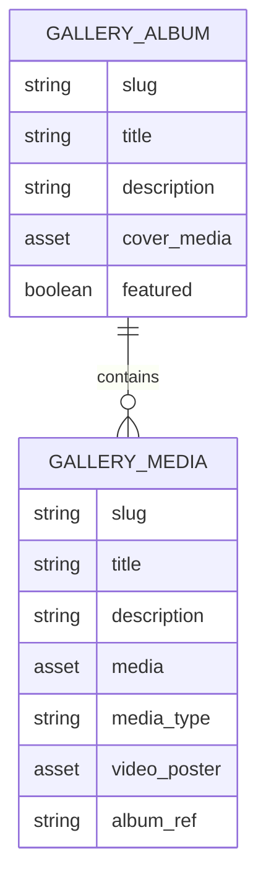

# 🚀 SG Handpan Studio — Advanced Gallery Implementation Task

## Context

The current Gallery implementation is flat and primitive:

- No album/folder grouping
- No first-class event grouping
- Limited description usage
- No structured video support
- Basic grid layout

We are redesigning the Gallery to support:

- Albums (folders/events)
- Featured albums & featured media
- Photo + video support
- Descriptions on albums and media
- Modern UI with high-quality lightbox
- Storyblok schema upgrade
- Migration scripts to recreate entities
- Backward-safe rollout

This document defines the complete implementation scope.

---

# 🎯 Objectives

## Functional Requirements

### 1. Albums (Folders / Events)

- Gallery page displays:
  - Featured albums (highlighted layout)
  - All albums grid

- Each album:
  - Title
  - Description (optional)
  - Cover media (image OR video thumbnail)
  - Date range (optional)
  - Tags
  - Featured flag
  - Optional link to existing Event story

- Album detail page:
  - Album header (title, description, meta)
  - Media grid (images + videos)
  - Lightbox with captions
  - Video playback inside lightbox

---

### 2. Media Items (Photos + Videos)

Each media item:

- Image OR video
- Title (optional)
- Description (optional)
- Alt text (for images)
- Photographer / credit (optional)
- Date taken (optional)
- Featured flag (optional)
- Sort order
- Tags
- Must belong to an album

---

### 3. Video Support (MANDATORY)

Gallery must support:

- Video assets uploaded in Storyblok
- Video thumbnail preview in grid
- Playable video inside lightbox
- Support mp4 (primary)
- Graceful fallback if browser cannot autoplay
- Poster image support
- Video icon overlay in grid
- Videos treated as first-class gallery items

Lightbox must support:

- Image slides
- Video slides
- Captions
- Keyboard navigation
- Mobile swipe
- Zoom for images
- Thumbnail strip (optional but recommended)

---

# 🧱 Architecture Decisions

## Frontend Stack

- Astro (existing)
- React islands (existing pattern)
- SCSS modules (existing styling pattern)
- Design tokens (existing)

---

## Recommended Libraries

### Layout

Use:

```
react-photo-album
```

Mode:

- Masonry OR Rows
- Responsive
- SSR-friendly

### Lightbox

Use:

```
yet-another-react-lightbox
```

Plugins required:

- Captions
- Video
- Zoom
- Thumbnails (optional but recommended)

Lazy load the lightbox bundle.

---

# 📁 New Routing Structure

```
/gallery
/gallery/albums/[slug]
```

Optional:

```
/events/[slug] → link to album if connected
```

---

# 🗂 Storyblok Schema Changes

We are introducing two new content types:

---

## 1️⃣ Component: `gallery_album`

Root component.

### Fields

| Field        | Type                    | Required |
| ------------ | ----------------------- | -------- |
| title        | text                    | yes      |
| description  | textarea                | no       |
| cover_media  | asset (images + videos) | no       |
| featured     | boolean                 | no       |
| sort_order   | number                  | no       |
| start_date   | datetime                | no       |
| end_date     | datetime                | no       |
| tags         | options (multi)         | no       |
| linked_event | multilink (story)       | no       |

Slug structure:

```
gallery/albums/{slug}
```

---

## 2️⃣ Component: `gallery_media`

Root component.

Replaces existing `gallery_item`.

### Fields

| Field        | Type                             |
| ------------ | -------------------------------- |
| title        | text                             |
| description  | textarea                         |
| media        | asset (images + videos) REQUIRED |
| media_type   | option: image / video            |
| video_poster | asset (image) optional           |
| alt_text     | text                             |
| photographer | text                             |
| date_taken   | datetime                         |
| featured     | boolean                          |
| sort_order   | number                           |
| tags         | multi-options                    |
| album        | multilink (story) REQUIRED       |

Slug structure:

```
gallery/media/{slug}
```

---

# 🧬 Data Model



---

# 🛠 Migration Plan

Create script:

```
scripts/migrate-gallery-to-albums.js
```

---

## Migration Steps

### 1. Backup existing gallery items

Export:

```
gallery_item
```

Save:

```
backup-gallery-items.json
```

---

### 2. Create new components via Management API

Ensure:

- gallery_album
- gallery_media

---

### 3. Create base folders

Ensure folders exist:

```
gallery/albums
gallery/media
```

---

### 4. Create Albums

Use mapping file:

```
albums.json
```

Structure:

```json
[
  {
    "album_slug": "beginner-workshop-2026",
    "title": "Beginner Workshop — Jan 2026",
    "description": "Highlights from the workshop",
    "linked_event_slug": "events/workshop-jan-2026",
    "media_slugs": ["gallery/photo-001", "gallery/photo-002"]
  }
]
```

---

### 5. Create Media Stories

For each old `gallery_item`:

- Detect media type:
  - If asset extension in (mp4, webm) → video
  - Else → image

- Move data into new `gallery_media`
- Attach album reference
- Preserve:
  - description
  - tags
  - featured
  - alt
  - photographer
  - date_taken

---

### 6. Video Handling

If media_type == video:

- If thumbnail exists → use as video_poster
- Else:
  - Either auto-generate placeholder
  - OR leave blank

---

### 7. Deduplication

Deduplicate by:

```
media.filename
```

Log duplicates in migration ledger.

---

### 8. Ledger

Generate:

```
migration-ledger.json
```

Track:

- created albums
- created media
- updated media
- warnings

---

### 9. Publish Order

Publish:

1. Albums
2. Media

---

# 🖥 Frontend Implementation

---

## 1️⃣ Gallery Landing Page

Path:

```
src/pages/gallery.astro
```

Responsibilities:

- Fetch albums
- Split featured and non-featured
- Render:
  - FeaturedAlbumsSection
  - AlbumGrid

---

## 2️⃣ Album Page

Path:

```
src/pages/gallery/albums/[slug].astro
```

Fetch:

- Album
- Media inside album (paginated if > 100)

---

## 3️⃣ Components

Create:

```
src/components/gallery/
  AlbumCard.tsx
  AlbumGrid.tsx
  AlbumHeader.tsx
  MediaGrid.tsx
  LightboxViewer.tsx
```

---

## 4️⃣ MediaGrid

Use:

```
react-photo-album
```

Transform Storyblok media into:

```ts
{
  src,
  width,
  height,
  alt,
  title,
  description,
  type: "image" | "video",
  poster?: string
}
```

---

## 5️⃣ LightboxViewer

Use:

```
yet-another-react-lightbox
```

Plugins:

- Captions
- Video
- Zoom
- Thumbnails

Slides mapping:

```ts
{
  type: "image",
  src,
  alt,
  title,
  description
}

{
  type: "video",
  sources: [{ src, type: "video/mp4" }],
  poster,
  title,
  description
}
```

Lazy load component.

---

# 🎨 UI Requirements

## Gallery Landing

- Hero header
- Featured albums horizontal layout
- Album grid below
- Clean modern spacing
- Subtle hover animations
- Video cover shows play icon overlay

---

## Album Page

- Back link
- Title
- Description
- Tag chips
- Masonry grid
- Lightbox overlay

---

# ⚡ Performance

- Use Storyblok Image Service resizing
- Use resolve_assets=1
- Use pagination if > 100 items
- Lazy load lightbox
- Do NOT load video files until clicked
- Use video preload="metadata"

---

# 🧪 Testing Requirements

Must verify:

- Albums render correctly
- Featured albums appear first
- Image lightbox works
- Video playback works
- Captions show for both image and video
- Mobile swipe works
- Keyboard navigation works
- Migration produces no data loss

---

# 🚦 Rollout Strategy

1. Deploy schema changes
2. Run migration on staging
3. Deploy new frontend (supports both structures temporarily)
4. Validate manually
5. Remove old gallery_item usage
6. Publish production migration
7. Deploy final frontend

---

# 📌 Acceptance Criteria

- Albums visible on `/gallery`
- Album page functional
- Images and videos supported
- Descriptions appear in lightbox
- Featured albums visually distinct
- Migration script idempotent
- No broken media links
- No SEO regression
- Lighthouse performance not degraded

---

# 🧠 Non-Goals

- No infinite scroll (yet)
- No user uploads
- No AI tagging
- No EXIF deep display

---

# 📦 Deliverables

Claude Code must:

1. Create Storyblok schema JSON files
2. Create migration script
3. Implement new frontend components
4. Replace old gallery implementation
5. Ensure video support in lightbox
6. Provide migration instructions in README

---

# 🔥 Final Instruction

Implement this as a production-ready, maintainable, clean architecture upgrade.

Preserve existing design tokens and SCSS conventions.

Do NOT introduce Tailwind.

Use typed data models where possible.

All code must be structured and modular.
